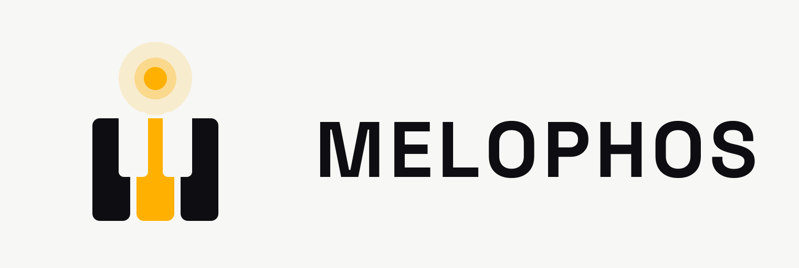
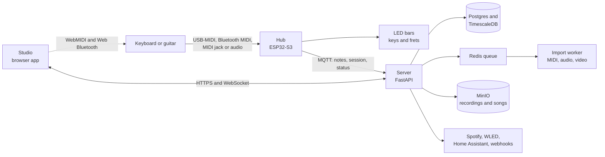

<h1 align="center">
  <picture>
    <source media="(prefers-color-scheme: dark)" srcset="assets/brand/melophos-wordmark-dark.svg">
    
  </picture>
</h1>

Song made visible. MELOPHOS is an open instrument learning platform: a small hub lights up the notes to play on a keyboard or guitar, captures every note played and turns practice into data you can see and share.

> [!NOTE]
> MELOPHOS is in early development. The code in this repository is the working scaffold each component grows from. The first hardware revision is in design. See [docs/roadmap.md](docs/roadmap.md) for what is planned and in which order.

## Why

I have monocular vision, which makes judging depth and scanning across a wide 88-key keyboard harder than it looks. Light-up keyboards helped, but every one I found was locked to one brand's app, one instrument and a subscription. MELOPHOS is the tool I wanted: lights on a single flat line right where my hands are, any instrument I own now or later and my practice data kept on my own server.

Accessibility is a design goal from the start rather than a feature added later, see [docs/accessibility.md](docs/accessibility.md).

## What it does

- **Light-guided practice.** LEDs above each key or along a fretboard show the next notes to play. Three practice modes: Melody waits for the right note, Rhythm holds a set tempo and Listen plays the piece through.
- **Any instrument.** Notes arrive over USB-MIDI, Bluetooth MIDI, 3.5 mm MIDI jacks or an audio input. Each instrument is described by a profile, so a new keyboard or a guitar is a configuration change rather than a rebuild.
- **Practice capture.** Every note event is logged against a practice session. The server turns sessions into streaks, accuracy, tempo progress and per-key heatmaps.
- **Song import.** MIDI files load directly. Audio goes through machine-learning transcription and tutorial videos with falling notes go through a computer-vision importer.
- **Integrations.** Spotify builds a learn list from listening history, WLED and Home Assistant make room lights react to playing and webhooks push sessions to any dashboard.
- **Self-hosted.** One `docker compose` command runs the whole server stack on a home server or a small VPS.

Planned for later versions: remote lessons where a teacher's playing lights up a student's instrument over WebRTC, a fingering coach using hand tracking and an optical sensor bar that turns an acoustic piano into a MIDI instrument.

## The name

MELOPHOS, pronounced MEL-oh-fos, joins two Greek words.

| Part | Root | Meaning |
| --- | --- | --- |
| MELO- | *mélos* (μέλος) | song or melody, the root behind *melody* |
| -PHOS | *phôs* (φῶς) | light, the root behind *photon* and *photograph* |

Together they describe what the hub does: it turns the notes of a song into light you can follow, which is where the tagline comes from: **song made visible**. The sister project [PHAEMOS](https://github.com/phaemos) is named the same way.

## Architecture



This is the design the scaffold grows into. The full picture, including which pieces exist today, is in [docs/architecture.md](docs/architecture.md). The reasoning behind each choice is in [docs/decisions.md](docs/decisions.md).

## Repository layout

This repository is the single source of truth. Every component folder is self-contained and is published to its own read-only repository on each merge to `main`, see [docs/repositories.md](docs/repositories.md).

| Folder | What it is | Published to |
| --- | --- | --- |
| [`firmware/`](firmware/) | ESP32-S3 hub firmware: inputs, note bus, LED rendering, session capture | `melophos/firmware` |
| [`core/`](core/) | Rust scoring engine shared by the Studio (WebAssembly) and the server (Python module) | `melophos/core` |
| [`hardware/`](hardware/) | KiCad designs: the hub board, octave LED bars, the fret bar and enclosures | `melophos/hardware` |
| [`server/`](server/) | FastAPI server, database schema, transcription worker, integrations and the self-hosting stack | `melophos/server` |
| [`studio/`](studio/) | Browser app for practice, song library and hub setup | `melophos/studio` |
| [`client/`](client/) | Python client and a hub simulator for development without hardware | `melophos/client` |
| [`profiles/`](profiles/) | Instrument profiles and their JSON schema, shared by every component | `melophos/profiles` |
| [`docs/`](docs/) | Architecture, protocol, roadmap and guides | `melophos/docs` |
| [`assets/`](assets/) | Brand files, photos, diagrams, renders and screenshots | stays here |

## Quickstart

### Server stack

```bash
cp server/deploy/.env.example server/deploy/.env
make up
```

Edit every `change-me` value in `server/deploy/.env` before starting the stack.

The API is then on `http://localhost:8000` with interactive docs at `http://localhost:8000/docs`.

### Studio

```bash
cd studio
npm install
npm run dev
```

WebMIDI works in Chrome, Edge and desktop Firefox 108 and later. Firefox asks to install a site permission add-on the first time a page requests MIDI access. Safari and Firefox for Android do not support WebMIDI. Every browser needs `https://` or `localhost`. Web Bluetooth needs Chrome or Edge.

### Firmware

```bash
cd firmware
pio run -e esp32-s3
pio test -e native
```

### Scoring engine

```bash
cd core
cargo test
```

### Without hardware

```bash
pip install -e client
melophos-sim --profile profiles/piano-88.json --server http://localhost:8000
```

The simulator plays a short practice session as if a hub were connected, so the server, Studio and integrations can be developed on a laptop alone.

## Hardware

The first revision is a hub board plus snap-together octave LED bars sized to real key spacing, so 61, 76 and 88 key instruments are covered without cutting LED strip. Details, the bill of materials and build notes are in [hardware/README.md](hardware/README.md).

## Licence

Software is licensed under the GNU Affero General Public License v3.0 or later. Hardware designs in `hardware/` are licensed under the CERN Open Hardware Licence v2, Strongly Reciprocal. [NOTICE.md](NOTICE.md) explains exactly which licence covers what.

## Contributing and support

See [CONTRIBUTING.md](CONTRIBUTING.md) to get involved, [SUPPORT.md](SUPPORT.md) for help, [SECURITY.md](SECURITY.md) to report a vulnerability privately and [ACCESSIBILITY.md](ACCESSIBILITY.md) for what the platform does for accessibility.
