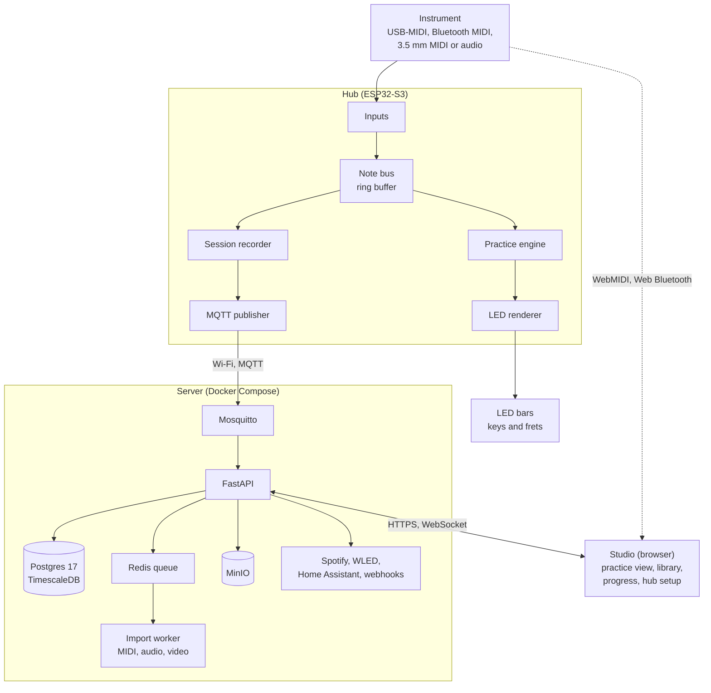
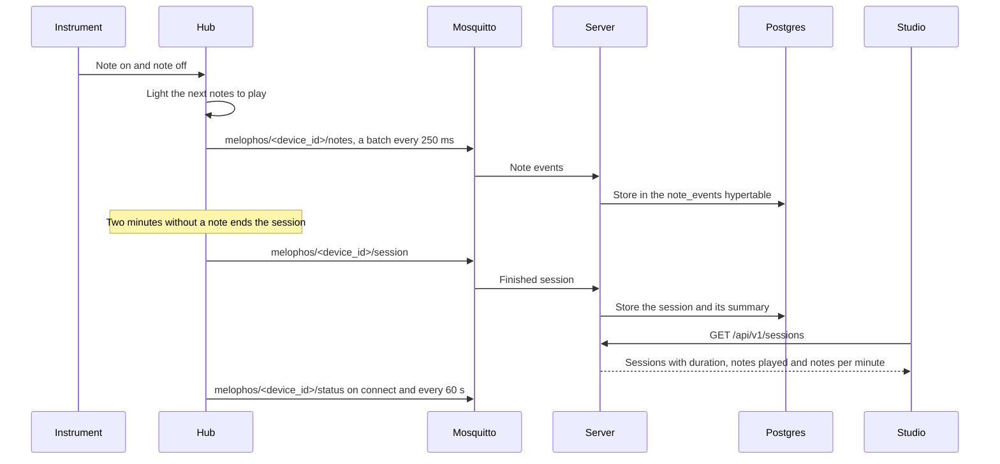

# Architecture

This page describes the design MELOPHOS is growing into. Each component in this repository is a working scaffold. [What exists today](#what-exists-today) shows how far each one has got.

## The pieces

## A practice session

The topics and payloads are defined in [protocol.md](protocol.md).

## Hub

The hub runs on an ESP32-S3 because it is the one widely available chip that combines a USB host port (to read and power a keyboard), Bluetooth LE (for Bluetooth MIDI and Synthesia) and Wi-Fi (for the server) with enough RAM for a full song.

- **Inputs** each run independently and push `NoteEvent`s onto one lock-free ring buffer, so a slow input never blocks the lights.
- **The practice engine** decides what each LED shows: played notes, the guide for the next notes, upcoming notes and wrong notes.
- **The LED renderer** maps notes to LEDs through the instrument profile and drives the WS2812B bars with FastLED, which uses the ESP32-S3's RMT peripheral for the timing.
- **The session recorder** groups notes into sessions automatically. A session starts on the first note and ends after two minutes of silence.

## Server

- **FastAPI** exposes the HTTP API and the WebSocket feed the Studio uses.
- **Postgres with TimescaleDB** stores sessions and every note event. Note events live in a hypertable because a single session can produce thousands of rows.
- **Mosquitto** receives hub traffic on `melophos/<device_id>/<kind>` topics.
- **Redis and the worker** handle slow imports (audio transcription, video reading) away from the request path.
- **MinIO** stores recordings and imported files with an S3-compatible API.
- **Prometheus and Grafana** are an optional monitoring profile.

## Studio

A static TypeScript app that talks to devices directly in the browser through WebMIDI and Web Bluetooth. It needs no server for plain practice with a local instrument. It uses the server for the song library, practice history and progress.

## Shared pieces

- **The scoring engine** in `core/` is one Rust crate compiled to WebAssembly for the Studio and to a Python module for the server, so a performance gets the same score in both places.
- **Instrument profiles** in `profiles/` are read by every component, so a note maps to the same LED everywhere.
- **The protocol** in [protocol.md](protocol.md) is the contract between the hub, the server and the Studio.

The reasoning behind each choice is recorded in [decisions.md](decisions.md).

## What exists today

| Component | Built so far | Still to come |
| --- | --- | --- |
| Hub firmware | The 3.5 mm MIDI input at 31250 baud, LED bars through FastLED and session capture with the two-minute idle gap. Every input reports whether it is live | USB-MIDI host, Bluetooth MIDI and audio input, the note ring buffer and MQTT publishing |
| Server | Health check, the sessions API with summaries (held in memory for now), MQTT topic validation, Spotify linking and the WLED and webhook integration modules | Storing sessions in Postgres, the MQTT subscriber, the WebSocket feed and Home Assistant |
| Database | The schema, with `note_events` as a TimescaleDB hypertable | Wiring it to the server |
| Import worker | The entry point and the import job types | A Redis queue and the importers themselves |
| Scoring engine | The Rust `score` function and its tests | WebAssembly and Python bindings |
| Studio | A keyboard view fed by WebMIDI, with instrument profiles | Web Bluetooth, the song library and progress views |
| Client | A Python client and a hub simulator | |

The [roadmap](roadmap.md) lists the order these arrive in.
